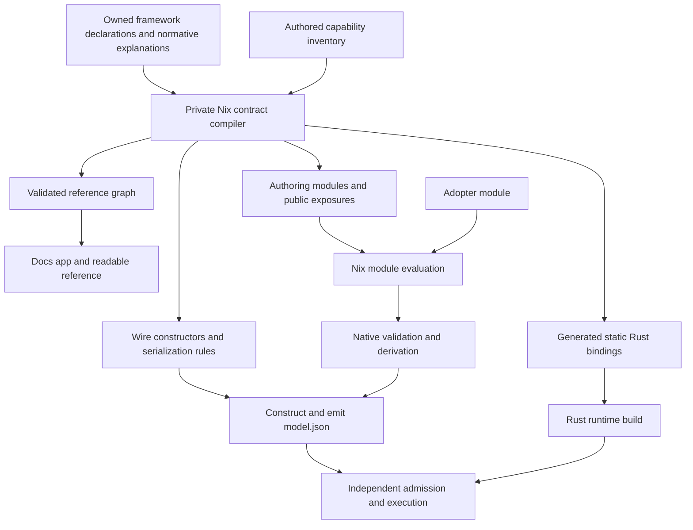

# RFC: Define Nixfied through a private contract meta-framework

Status: proposed architecture; this document authorizes no implementation or
change to the active contract by itself.

Problem statement: [FIXES_DOCS_REFS.md](FIXES_DOCS_REFS.md).
Normative boundaries: [docs/CONTRACT.md](docs/CONTRACT.md).
Architecture: [docs/ARCHITECTURE.md](docs/ARCHITECTURE.md).
Derived facts: [docs/DERIVATION_SPEC.md](docs/DERIVATION_SPEC.md).

## 1. Decision and intended outcome

Define Nixfied's supported public contract through a private Nix meta-framework:
a small contract compiler whose declarations require executable structure,
explanations, and relationships appropriate to each public surface.

Nixfied is the first and only intended consumer. The meta-framework is internal
implementation machinery, with no new adopter DSL or independently versioned
plugin interface. Adopters continue writing ordinary Nix modules.

The same authored contract supplies:

- Nix option declarations, public library exports, adapters, and flake products;
- command grammar, conventional help, environment resolution policies, public
  result shapes, and error contracts;
- phase-specific rules, derivation interfaces, and behavioral explanations;
- the model's wire structure and constructors used to produce `model.json`;
- generated Rust contract bindings compiled into the runtime;
- a connected, revision-bound reference exposed through `.#docs`.

Rust remains the admission and execution implementation. It consumes the
compiled model and statically generated bindings, independently validates
untrusted input, and enforces host and runtime invariants. It does not author or
extract the framework reference, load a documentation graph, or invoke Nix.

The central invariant is:

> A supported public declaration cannot be exposed through Nixfied's publication
> mechanism without its required contract information. Execution and reference
> generation consume the same structural facts; native behavior has an explicit
> owner and independent evidence.

This defines the whole public contract through one construction discipline.
Native Nix algorithms and Rust runtime mechanisms remain implementations of that
contract. The meta-framework does not attempt to express every algorithm in a
new symbolic language.

## 2. Problem and evidence

An adopter asked what alternatives exist to `stateRefs = [ "slot" ]`. Answering
required seven hops through a pinned store checkout, including compiler and
runtime internals. A supplied reference should answer ordinary authoring
questions without that reconstruction.

The current option pipeline is a useful foundation:

- [options.nix](nix/docs/options.nix) uses the existing module evaluator and
  `pkgs.nixosOptionsDoc`.
- The pinned generator exposes `optionsNix` and `optionsJSON`, with canonical
  option paths, descriptions, types, formatted defaults, and examples.
- The current evaluation produces 128 public option entries. Exact lookup can
  reuse these records without parsing Markdown or replacing submodule traversal.

It also exposes the limits of the current representation:

- `stateRefs` is described as participating in service identity, but
  [identity.rs](runtime/crates/nixfied-runtime/src/service/identity.rs) excludes it
  and [lower.rs](runtime/crates/nixfied-runtime/src/execution/lower.rs) discards it.
- Invocation timeouts use a positive-integer predicate, while the generated type
  description says only "signed integer". A native check has lost a fact that a
  structured range declaration could retain.
- [validate.nix](nix/compiler/validate.nix) has 35 check entries, with additional
  public constraints enforced in [derive.nix](nix/compiler/derive.nix).
- Runtime flags, help, defaults, and error projection are spread across native
  parsing branches. Output contracts combine serialized structs with dynamic
  JSON construction.

The correct current `stateRefs` answer must remain explicit: it accepts a list
of strings and defaults to `[ "slot" ]`. These strings select neither storage
backends nor alternative runtime state roots. They do not change service reuse
identity. They remain serialized model data and appear in the model view, so
changing them changes the raw model hash; execution lowering discards them.
The sibling service/task ref fields need the same accuracy review.

Generation establishes agreement between projections. Independent behavioral
proofs establish whether an authored explanation matches execution.

## 3. Scope and guarantees

### 3.1 Public surface

The target is every supported framework-owned public declaration, including open
schema families. Internal Rust `pub` items and framework-only escape hatches are
not automatically adopter API; existing supported surfaces cannot be hidden to
obtain a passing coverage count.

| Surface | Required coverage |
| --- | --- |
| Authoring | Options, nested domains, defaults, transformations, constraints, and supported extension points. |
| Nix integration | Library functions, supplied module arguments, adapter modules, public packages/apps, and artifact layout. |
| Commands | Grammar, cardinality, defaults, effects, baked-in arguments, outputs, and failure behavior. |
| Invocation context | Environment inputs, source resolution, platform conditions, and resolution precedence. |
| Results | Public serialized fields, variants, units, omission conditions, and explicitly open data. |
| Failures | Error vocabulary, phases, detail contracts, exit behavior, redaction, and recovery guidance. |
| Behavior | Derivations, lifecycle, admission, state, containment, cleanup, and execution guarantees. |

Adopter task names and custom flake apps remain project facts. Nixpkgs and child
programs retain their own contracts. Framework schema coverage does not claim to
enumerate arbitrary Nix programs or child behavior.

### 3.2 What is enforceable

| Guarantee | Owner and rejection boundary |
| --- | --- |
| Required public metadata exists. | Declaration compiler rejects incomplete kind-specific records before publishing a reference or executable surface. |
| Public structural facts have one definition. | Option, export, grammar, and wire generators consume their owning declarations. |
| Relationships resolve and respect scope. | Contract compiler rejects duplicate identities, dangling targets, wrong target kinds, and invalid bindings. |
| Rules retain their execution phase. | Existing compiler/runtime owners invoke declared rules with their phase's inputs. |
| Model construction is complete and coherent. | Nix wire construction and existing validation reject malformed lowered values before model publication. |
| Untrusted models remain independently admitted. | Rust validates structure, references, ABI, host facts, and independently derived facts before relevant side effects. |
| Reference content is static and revision-bound. | Packaging binds declarations and provenance to the supplying framework input. |

Nix constructors provide evaluation/build guarantees, not language-level opaque
types. The public facade and coverage checks must catch manual bypasses.

The compiler can reject an absent explanation. It cannot prove that arbitrary
English is true, that a native predicate implements that English, or that a
reader understands it. Coverage, relationship integrity, and behavioral evidence
are separate acceptance dimensions.

### 3.3 Non-goals

- Replace Nix parsing, module evaluation, merging, or package realization.
- Add a universal rule interpreter, runtime schema loader, daemon, or dynamic
  orchestration language.
- Add documentation, implementation callbacks, or reference metadata to the
  model, registry, or runtime admission inputs.
- Generate both independent graph algorithms from one implementation.
- Remove unused model fields, redesign state policy, or change placeholder
  grammar as a prerequisite for documentation.
- Turn the meta-framework into a public framework for unrelated products.

## 4. Architecture: two compilations from one contract



### 4.1 Framework compilation

Framework compilation validates declarations and relationships, generates the
public authoring interface and static bindings, and builds reference content.
Its inputs include the supplying framework source and supported evaluation
context such as system and pinned Nixpkgs. It requires no adopter configuration,
model, executable realization, runtime state, or secret values.

Declarations separate a checked static payload from delayed implementation
bindings. Reference validation must not recursively force callback bodies,
project-derived defaults, package builds, or configured project values. An
implementation receives its context only when its owning phase invokes it.

The normalized declaration index and reverse links are private generated data.
They are neither a second authored catalog nor a runtime semantic artifact.

### 4.2 Project compilation

Project compilation uses the generated module declarations with Nixpkgs'
existing evaluator, then follows the existing pipeline:

```text
adopter module
  -> resolve and merge
  -> validate resolved declarations
  -> derive and lower with phase-local checks
  -> construct declared wire values
  -> realize closures and emit model.json
```

The meta-framework supplies contracts and construction mechanisms to this
pipeline. Native algorithms still compute closure resolution, graph facts,
logical placement, and other derived values. Merely serializing the static
reference graph cannot produce an executable project.

### 4.3 Relationship to the existing project compiler

The meta-framework replaces part of the handwritten machinery in `nix/compiler`
while retaining the project compilation pipeline and its native algorithms.
Framework compilation defines what Nixfied supports; project compilation turns
one adopter's configuration into `model.json`; Rust independently admits and
executes that model.

| Current responsibility | Proposed implementation |
| --- | --- |
| Module evaluation and merging in `resolve.nix` | Continue using Nixpkgs' evaluator with generated option declarations. |
| Simple structural validation | Generate checks from the owning domain and rule declarations. |
| Complex validation in `validate.nix` and `derive.nix` | Retain native predicates bound to declared rules at their existing rejection phases. |
| Graph derivation, executable resolution, and lowering | Retain native Nix algorithms with declared inputs, outputs, relationships, and independent proofs. |
| Handwritten model record construction and serialization policy | Replace with constructors and serialization rules generated from wire declarations; native lowering supplies the values. |
| Closure realization and artifact emission in `emit-model.nix` | Retain Nix packaging responsibilities and consume the generated model construction path. |
| Pipeline coordination in `default.nix` | Keep a thin project compiler coordinating resolution, validation, derivation, construction, and emission. |

As each responsibility migrates, delete its superseded handwritten definitions.
The meta-framework and project compiler must not become competing owners of the
same checks or wire shapes. Native algorithms remain substantial implementation
work even when the pipeline coordinator is small.

The `nix/compiler` directory can remain as the home of project compilation.
Implementation may reorganize files; acceptance depends on clear ownership,
preserved rejection phases, and removal of duplicate definitions rather than a
particular directory layout.

### 4.4 Proposed organization

Keep the meta-framework and all authored meta-definitions together under
`nix/meta/`. Separate its small compilation kernel from the definitions of
Nixfied built on that kernel:

```text
nix/meta/
  default.nix                compose definitions and expose checked projections
  kernel.nix                 constructors, validation, projection generators
  definitions.nix            Nixfied's authored meta-definitions
  regenerate.nix             packaged development tool for generation/checks

nix/modules/                 consume generated options; native module composition
nix/compiler/                native evaluation, algorithms, lowering, realization
nix/adapters/                native adapter implementations
nix/docs/                    reference presentation, lookup, packaging
runtime/crates/*/             generated static bindings plus native mechanisms
```

Start with these files, not a directory per declaration category. Options,
exposures, rules, wire shapes, commands, context inputs, and guarantees are kinds
of definitions, not mandatory modules or subdirectories. Split `kernel.nix` or
`definitions.nix` only when the implemented code needs it; keep any resulting
files under `nix/meta/`. `default.nix` is the composition entry point, not another
registry. Packaging generated projections can live there without a separate
`generated.nix` layer.

This is the target source organization, not an adopter-facing import API.
`nix/meta/definitions.nix` is the place to review what Nixfied exposes, accepts,
relates, and guarantees. Native implementation directories consume those
contracts; they do not retain separately authored copies of migrated definitions.
Move existing structural definitions into `meta` as their owners cut over,
including applicable definitions currently under `nix/spec/`. Do not leave
forwarding catalogs or a second inventory of public names behind.

`default.nix` composes definition bundles by responsibility, rather than repeating
every declared name in a registration file. Each bundle owns both the declaration
and its implementation binding. Pure structural checks can be generated entirely
from these definitions. Complex algorithms remain native: a rule definition binds
a native predicate directly, and its phase owner invokes the resulting checked
rule in the existing order. Keep imported native helpers independent of the
assembled meta-framework to avoid an import cycle; pass project context only at
execution, never during static metadata extraction.

The authored `runtime/crates/nixfied-model/capability.txt` remains the explicit
exception: it retains its current location and ABI authority, and `meta` imports
it. Generated Rust stays with its consuming crate; generated reference snapshots
stay under `docs/`. Centralizing definitions does not move runtime behavior into
Nix or require the project compiler and native algorithms to be generated.

The directory name `meta` identifies the source layer, not a prefix in public
reference identities. An option remains `nixfied.tasks.<task>.invocation.timeoutMs`
regardless of the source file that declares it. Documentation source links point
to its definition under `nix/meta/`; semantic references retain the canonical
option, exposure, rule, and inventory identities specified below.

## 5. Declaration model

### 5.1 Closed declaration families

Use distinct constructors with kind-specific required fields. A single record
with interchangeable optional fields would hide invalid combinations.

| Family | Authored contract | Generated or bound implementation |
| --- | --- | --- |
| Domain | Value structure, bounds, alternatives, and relevant units. | Nix type/check and, where representable, wire/native binding. |
| Option | Domain, presence/default policy, explanation, examples, relationships. | Existing `mkOption` surface and structured reference. |
| Exposure | Function/module/product alternative, arguments/results or usage contract, explanation. | Public export or module binding with its existing caller interface. |
| Command | Argument grammar, repetition/default policy, handler identity, results/errors. | Native parser bindings, conventional help, app wiring, reference. |
| Context input | Input name, resolution policy, consuming operations, explanation. | Constants and typed resolver bindings to native implementation. |
| Rule/derivation | Phase, input/output references, executable relation or native implementation, explanation. | Phase-local invocation and connected reference. |
| Guarantee | Normative statement, enforcing owner/phase, relationships, evidence. | Referenced behavioral explanation and proof obligations. |
| Wire/result/error | Serialized structure or explicit open shape, vocabulary references, conditions and meaning. | Model constructors, Rust bindings, result contracts, reference. |

These are compile-time declaration kinds. They add no semantic task/service kinds
to the runtime model.

### 5.2 Reuse existing Nix domains

The initial domain vocabulary needs only primitives, bounded values, enums,
lists, maps, products, and explicit alternatives that existing surfaces use.
Nix-only packages, paths, modules, and functions remain native authoring domains.
Their lowering is explicit; a package does not become a JSON value simply
because it is accepted by a Nix option.

Domain constructors delegate merging and evaluation to Nixpkgs. Add a structured
constraint when it can generate an existing predicate and explain the same fact.
For native checks, require an explanation and preserve their existing mechanism.

Authoring presence distinguishes required input and a supplied literal or
contextual default. Optional values use an explicit nullable domain/default,
not implicit omission. A default of `null` is a real default. Wire presence additionally
records whether absence and explicit null are accepted and what serialization
emits. Nix defaults, wire decode defaults, and command fallback policies are
separate facts unless an explicit relation connects them.

#### Defaults and concise authoring

Prefer short declarations with sane, visible defaults. Authors supply the facts
that distinguish a definition; they should not repeat empty metadata, standard
policies, or mechanically derived names. Constructors normalize this concise
input into the complete tagged records used by validation and every projection.
There is one normalization path, not separate defaults in docs, Nix, and Rust.

| Authored omission | Effective default |
| --- | --- |
| `relations`, examples collections | Empty list |
| `moduleArgs` | Empty attrset; preserve native module behavior |
| `unit` | No unit annotation |
| Additional integer bound | No additional bound beyond the native domain |
| Option presence without a value default | Required; never invent a value |
| Wire `unknownFields` | Reject |
| Wire field `policy` | Required, non-null |
| Wire field `producer` | Caller supplies the value |
| Unsigned shape `nonzero` | False; positivity must be declared |
| Command argument repetition | Reject duplicates unless explicitly overridden |

`default = value` is shorthand for `presence = api.defaultValue value`.
A contextual default still uses `api.defaultFrom { expression; resolve; }`.
Supplying both `default` and `presence` is an error, including when `default`
is `null`. Use attribute presence, not truthiness, to distinguish omissions.
Unknown keys remain errors; defaulting must not conceal misspelled declarations.
Explanations, domains, semantic identities, and required native behavior are
not fabricated from defaults.

For adopter configuration, give each option a useful default wherever one is
valid for its role: existing examples include invocation timeout, working
directory, stdin policy, and an empty environment. Put that default in the owning
option or shared declaration fragment once. Reuse fragments with ordinary Nix
composition; use existing module defaults and override priorities for adopter
configuration. Do not introduce an ambient defaults registry or a second merge
system. Related values may use an explicit contextual default instead of copying
a literal across definitions.

A type alone cannot choose a useful value: a string is not automatically empty,
a list is not automatically empty, and a nullable option is not automatically
`null`. Executable argv, tool requirements, project identities, and other inputs
without a valid universal value remain required. Runtime-owned host placement and
secrets remain runtime-owned. Wire decode defaults and command fallback policies
remain separate from authoring defaults.

These defaults reduce declaration size without changing accepted inputs.
Migration must explicitly override any constructor default that differs from
existing behavior, such as last-occurrence-wins flags or optional wire fields.
Changing a shared semantic default is a contract change affecting every consumer;
check its projections and existing ABI obligations together. Documentation shows
effective defaults and contextual expressions, even when omitted at each use.

### 5.3 Example: timeout

Illustrative private syntax; constructor spelling is not an adopter API:

```nix
timeoutMs = api.option {
  domain = api.integer { min = 1; };
  default = 30000;
  unit = "milliseconds";
  explanation = "Maximum invocation duration before cancellation.";
};
```

The domain generates the positive-integer check and the documented lower bound.
The option reference continues to use the existing generator's canonical path,
formatting, and visibility behavior. No separate list of option names is added.

The corresponding model field has its own wire contract and lowering relation.
Its Rust binding must preserve the existing validated domain rather than admit
an unchecked integer and rely on documentation to describe positivity.

### 5.4 Exposure discipline

Generate public functions, adapters, supplied module arguments, products, and
framework app names from their declarations. Derive reserved project-app names
from the same framework exposure set; adding `docs` updates that set once.

Preserve existing caller interfaces, including `lib.seq`'s distinct-task
restriction and ordinary module override semantics. Evaluated adapter defaults
are contextual examples; they are not the effective configuration of every
adopter or a separate adapter option namespace.

Check actual framework-owned exported surfaces against declared entries. Nix
allows manual attrset extensions, so two projections of the same incomplete
list cannot prove that no export bypassed the construction mechanism.

## 6. Relations, rules, and premises

### 6.1 References and scope

Derive option and export identities from their exposure paths. Author stable
identities for rules and behavioral concepts that lack such a path. References
resolve to those entries; a string that happens to look like a path is not an
unchecked escape hatch.

A small relation vocabulary covers current needs: `references`, `constrainedBy`,
`defaultsFrom`, `derivedFrom`, `lowersTo`, `overrides`, `produces`, `mayFailWith`,
and `guaranteedBy`. Each relation has allowed endpoint kinds and any necessary
scope binding. Forward and reverse navigation derive from the same edge.

Open families require distinct bindings even when their rendered segments use
`<name>`:

- A task's `requires` names keys in the global service map.
- A step's `dependsOn` names siblings in that same composite task.
- A service's primary endpoint names a key in its own endpoint map.

The reference compiler checks these schema scopes. Project validation checks
actual instance references. Reference links can be cyclic; they do not define
an execution DAG, phase schedule, or runtime dependency algorithm.

### 6.2 Executable structural rules

For a simple relation, one declaration can generate both validation and its
explanation:

```nix
slotWithinBounds = api.betweenInclusive {
  id = "slot-default-within-bounds";
  phase = "validate";
  value = api.optionRef [ "nixfied" "slotPolicy" "default" ];
  lower = api.optionRef [ "nixfied" "slotPolicy" "min" ];
  upper = api.optionRef [ "nixfied" "slotPolicy" "max" ];
  diagnostic = input: "slotPolicy.default must be within the slot range";
};
```

This removes duplicated option associations and comparison logic. The three
options retain their owning declarations. Preserve existing diagnostics and
evaluation order unless an explicit contract change authorizes a difference.
The diagnostic renderer remains owner-specific; the example preserves the
existing validation message.

### 6.3 Native rules and derivations

Graph, executable, and cross-field rules that need native algorithms retain
those algorithms. Their declarations require phase, relevant inputs/outputs,
explanation, relationships, and an implementation binding. Metadata extraction
never calls the predicate against an incomplete project.

Keep checks where sufficient information exists. In particular, migrate rules
from both `validate.nix` and `derive.nix`: endpoint forms, probe/effect coherence,
executable resolution, narrowing gates, and endpoint capacity are public rules
although some execute during lowering or derivation.

The existing phase owner invokes a rule at its existing position. The reference
graph does not choose invocation order. A missing native binding must fail
construction or compilation rather than silently turn the rule into prose.

Derived facts such as `servicesRequired` and `operationBindings` keep their
native Nix algorithms and independent Rust implementations. Their specifications
remain in `docs/DERIVATION_SPEC.md`, linked by stable identities.

### 6.4 Behavioral premises and evidence

Cleanup confinement, service reuse, redaction, and failure precedence are owned
guarantees. Their declarations bind a normative explanation to the enforcing
owner and relevant public surfaces. A guarantee is not a predicate evaluated by
the documentation builder.

Keep normative prose in `docs/CONTRACT.md` and derivation prose in
`docs/DERIVATION_SPEC.md`. The meta-framework may import identified sections;
requiring a declaration does not require copying all prose into Nix strings.
When explanation ownership moves, replace the former copy with a generated
projection or reference in the same cutover.

Evidence references must point to real checks or fixtures. Their existence is
traceability, not proof of sufficiency. Independent accepted/rejected cases and
runtime tests remain the evidence for important effects. Reuse existing tests
and executable examples rather than generate a second set of illustrative
examples that can drift.

### 6.5 Example: task dependencies

A `requires` entry must lead to the distinct owned facts that:

1. Every element names a declared service.
2. Dependencies participate in readiness, lifetime, and derived service closure.
3. Endpoint-less required services remain valid dependencies.
4. Task-side named endpoint placeholders use required service IDs and select
   their primary endpoints; task-side endpoint IDs are not a separate namespace.
5. Bare endpoint placeholders select the first required service and fail when
   it has no endpoint; they do not skip to a later dependency.

Reference validity, addressability, derivation, and runtime lifecycle keep their
own rules. Their connected presentation answers the adopter's question without
moving all enforcement into one layer.

## 7. Generating model.json

### 7.1 Authoring and wire contracts are distinct

The meta-framework owns declared wire shapes as well as authoring declarations,
with explicit lowering relationships between them. They are not one identical
schema:

| Authoring input | Model construction |
| --- | --- |
| Package-valued invocation tool | Realized closure metadata and tool reference. |
| Singular `endpoint` sugar | Normalized endpoint map and primary endpoint. |
| Tasks, steps, and service dependencies | Static primitives plus independently verifiable derived facts. |
| Exported verb descriptions | Nix app metadata; no model field. |
| `stateRefs` | Serialized current field, explicitly unused during execution lowering. |

This distinguishes transformations, derived values, and Nix-only information.
Reference relationships explain them; native lowering performs them.

### 7.2 Close the producer boundary

Generate wire constructors and serialization policies from the validated wire
declarations. Existing lowering supplies their values. Producer construction
rejects undeclared record members, missing required members, invalid values, and
incoherent alternatives. Dynamic map keys follow their declared domains.
Force validation of the entire constructed JSON-compatible value before returning
it or publishing model bytes. Strictness here applies to the produced data, never
to the contract graph or implementation callbacks.

Generated Rust decoding must preserve the existing accepted wire inputs,
including unknown-field, omission, null, and decode-default policies. Equivalent
producer output does not prove equivalent consumer acceptance. Replacing a
discriminated record and its coherence checks with a tagged alternative requires
proof of the same accepted/rejected inputs or an explicit contract change.

A wire field addition must require an explicit construction/lowering decision.
Neither the Nix constructor nor generated Rust bindings may silently supply
zero, null, or an ignored field as a universal fallback. Declared defaults remain
possible only where the existing contract defines them.

Preserve exact emitted names, omission/null behavior, enum encodings, ordering,
and raw model bytes for behavior-preserving migration fixtures. Because the
runtime hashes raw bytes, serialization differences need explicit review even
when decoded values compare equal.

### 7.3 Preserve realization and admission

[emit-model.nix](nix/compiler/emit-model.nix) currently retains `derived.packages`
as build inputs. The new construction path must preserve that closure realization
obligation. Documentation generation must not inherit it.

`model.json` remains the only required per-project semantic artifact. The
existing model-derived `views/docs.md` remains disposable. No contract graph,
schema descriptor, docs path, callback, secret value, or host-absolute runtime
placement is added to the model.

Generated wire structure is not a certificate that a model is safe. Rust still
parses and validates untrusted bytes, checks exact ABI/toolchain and model origin,
proves references, independently re-derives graph facts, and enforces host and
phase-specific runtime invariants.

## 8. Rust as a runtime consumer

### 8.1 Generate bindings before the Rust build

The Nix-owned contract compiler emits static Rust source for the facts Rust must
consume: command grammar and help, field/variant structure, exact vocabulary,
and convention-derived bindings to native handlers, resolvers, and validated
domains. Authored definitions contain semantic identities and requirements;
Rust names, paths, and type mappings belong exclusively to the Rust backend.
It emits only the necessary executable projection, not the reference graph.

The selected backend emits ordinary Rust source directly from validated Nix
values. It uses a bounded set of templates/functions for the supported types,
serialization attributes, grammar forms, and native bindings. Identifier and
string-literal rendering must be explicit and tested. Native Nix functions are
not serialized or translated into Rust algorithms.

Rust compilation checks those bindings. For example, a generated command enum
is matched exhaustively by native dispatch; a missing command handler fails to
compile. Domain references bind to existing private/fallible constructors,
newtypes, and validation traits. A generator must not replace `UniqueVec`,
nonzero values, confined paths, or validated endpoint hosts with weaker raw
values merely to simplify emission.

Native Rust owns admission, execution, reconciliation, lifecycle, containment,
state, secrets, output/redaction, and cleanup. Those implementations and their
independent tests remain ordinary Rust. No Rust documentation extractor or
build-host runtime invocation is needed.

### 8.2 Commands and environment resolution

Generate parsing facts and help from command declarations. Native handlers retain
cross-field checks and their typed failures. Framework-injected arguments such
as model paths and exported task selections are distinct from caller-selectable
arguments and unstable framework test switches.

The declaration vocabulary must represent existing behavior before replacing
parsers: repeated flags, missing/invalid values, help precedence, unknown
arguments, numeric parsing, and error output selection. Current commands do not
all have the same repetition or help policy. Preserve those differences unless
a reviewed ABI change deliberately replaces them.

For `run --output`, connect accepted mode vocabulary, repeat handling, the root
task's `defaultOutput`, and the direct-selection restriction checked after model
admission and before slot/state side effects.
For `run --slot`, connect explicit selection, `slotPolicy.default`, inclusive
bounds, and the selected model placement. Default resolution that needs an
admitted model remains a runtime operation.

Environment declarations supply names, consuming operations, precedence, empty
versus unset handling, platform conditions, and explanation. Generated bindings
must be consumed by native resolvers; a detached list of environment names
would leave the original duplication intact. Host paths and secret values are
resolved only at runtime.

### 8.3 Outputs and errors

Generate structural output bindings with exact serialized names, variants,
units, null/omission policies, and relationships. Runtime implementations supply
observed values and enforce redaction and write behavior.

A field implemented as arbitrary JSON requires an explicit open contract. Do
not infer a closed schema from examples. Moving currently dynamic output into a
closed shape requires review of the actual existing output and failure behavior;
where the implementation does not enforce closure, document that limitation.
Fixed public fields assembled with `json!` still need declared contracts. The
absence of a Rust struct does not make their shape open; declaring every JSON
value open solely to pass coverage is not an acceptable migration.

Error declarations require code, meaning, applicable phases, detail contract,
exit behavior, and recovery guidance. Native failure precedence, compound causes,
redaction, and cleanup continuation remain runtime mechanisms with independent
proofs. A generated error enum alone cannot enforce those properties.

### 8.4 Installation tooling

The public install/upgrade contracts also become meta-framework declarations.
The existing installer lives in `nixfied-cli`; upgrade uses Nix-packaged shell.
Those are delivery mechanisms, distinct from `nixfied-runtime`.

For this RFC, keeping Rust runtime-only means Rust mechanisms consume the
authored contract and own no reference-authoring or extraction layer. It does
not silently require rewriting the existing installer in another language.
Generate its grammar/help bindings at its existing owner, preserve its package
isolation, and keep installation behavior outside the runtime model.

## 9. Documentation and build delivery

### 9.1 Adopter interface

The first delivery preserves the concrete discovery interface:

```sh
nix run .#docs
nix run .#docs -- options
nix run .#docs -- options nixfied.services
nix run .#docs -- option 'nixfied.services.<name>.stateRefs'
nix run .#docs -- topic state
nix run .#docs -- topic placeholders
```

`<name>` is a literal canonical schema segment. Namespace listing discovers the
key before exact lookup. The index progressively exposes listable command,
function, adapter, environment, output, error, rule, and guarantee categories.
Their final query syntax belongs to their implementation cutover.

Entries present their explanation, accepted structure, defaults, constraints,
effects, examples, and typed relationships as applicable. Topics cover authoring
limits, tasks/services, state, endpoints/placeholders, secrets, adapters, and
operation/recovery. Topics remain readable without following source-code links.

Unknown names and malformed queries fail nonzero with lookup guidance. Successful
content goes to stdout; diagnostics go to stderr. No browser or interactive pager
is required. The app performs static lookup and formatting only.

### 9.2 One content builder, no Rust build dependency

The app, full readable reference, and any public docs package use one Nix-owned
content builder. Reuse the current option generator's `optionsNix`/`optionsJSON`
and full renderer. Preserve its canonical paths, visibility filtering, formatted
Nix expressions, and distinction between absent and null defaults.

Contract declarations are upstream inputs to sibling documentation and
runtime-binding projections. Building or running the reference must not require
rustc, Cargo, the runtime binary, project executables, or a compiled project model. The
realized docs app invokes neither Nix nor Rust. Build-time rendering tools are
ordinary Nix dependencies and should be measured separately from its runtime
closure. Existing option-renderer dependencies may transitively include SQLite;
the excluded dependency is the Rust/runtime build, not every occurrence of that
library in a rendering toolchain.

### 9.3 Generated source and snapshots

Generate Rust bindings deterministically from Nix values. No import-from-derivation
is needed: Nix evaluation must not read a generated artifact back to discover
contract structure. Cargo compiles the generated source as ordinary crate source;
the baseline adds no per-crate build script or serialized intermediate contract
for binding generation. No Cargo build script invokes Nix.

Keep generated Rust modules checked in as disposable source projections so
fixture-backed Cargo and editor workflows continue to use ordinary source.
Regeneration checks compare them byte-for-byte with fresh generator outputs.
Nix product builds verify the relevant projection before compiling the checked
sources; release builds cannot ship stale bindings through an unchecked path.

Only executable contract bytes enter each product's filtered Cargo source.
Reference prose, reverse links, examples, and provenance are excluded. Conventional
help or recovery text deliberately compiled into a product is an executable
projection and can legitimately rebuild it. Preserve separate CLI, runtime/model,
and test-child source boundaries. Freshness checks consume the relevant generated
bytes and checked sources, without adding the full framework source or reference
tree to every product's build dependencies. Prose-only changes outside embedded
text must preserve product derivation identities as well as generated bytes.

Keep a deterministic human projection of the complete public reference under
`docs/`, checked for drift, so the existing README/docs upgrade report includes
explanations authored outside that directory. Exact lookup and this projection
must agree. Generated outputs are edited through their owning declarations.

### 9.4 Revision binding and evaluation availability

Construct the generic docs app from the framework input supplying `projectApps`.
Expose the same generic app on the framework's own flake. Packaged provenance
records that source identity and a revision when available, without assuming Git
or resolving a default branch at runtime.

Keep provenance outside deterministic checked reference/source snapshots.
Embedding the changing source revision into those snapshots would create
regeneration churn and can create self-referential source identities.

There are two separate availability guarantees:

1. **Content independence:** reference generation uses no adopter configuration,
   model validation, project executable builds, admission, or state.
2. **Project app selection:** `.#docs` remains usable when the surrounding flake
   and its project app names can evaluate, even if later model validation fails.

The current flat app attrset merges fixed apps with dynamically named task apps.
Computing those names can force `surface.verbs`. Putting `docs` on either side of
that merge cannot make selection survive a failure while computing the names.
This RFC preserves the current caller interface and states that limit explicitly.
The framework app selected through an explicit supplying source remains the
recovery entry point; it must never silently choose a different framework pin.
A stronger project-app selection guarantee requires a separate integration change.

Contextual `.#help` continues to reflect final project app metadata, including
custom apps and composition. Generic `.#docs` describes the supplying framework
contract. The framework reference, compiled project view, and live observations
retain these distinct scopes.

## 10. Capability inventory and contract ownership

[capability.txt](runtime/crates/nixfied-model/capability.txt) remains authored wire
inventory whose exact bytes derive `runtimeAbi`. It is an input to the
meta-framework, not an output or documentation catalog.

Use a small strict reader for its existing vocabulary records. Rich declarations
reference those members and supply their shape, parsing policy, explanation,
and relationships. Enum alternatives derive from the inventory. Wire fields and
output/error members are checked for exact coverage; references to inventory
members are not a second independently maintained vocabulary list.

This keeps facts complementary:

| Fact | Authored owner |
| --- | --- |
| Exact inventoried wire vocabulary and ABI record | `capability.txt`. |
| Shape, presence, parsing, projection, and exposure contracts | Owning meta-framework declarations. |
| Normative behavior and derivation explanations | Identified sections in CONTRACT/DERIVATION_SPEC. |
| Native implementation and independent proof | Existing Nix/Rust enforcing owners and tests. |

The inventory is not a complete semantic fingerprint. Changing a type,
condition, or algorithm does not automatically change its bytes. Every admitted
vocabulary, model, command, output, error, or behavioral ABI change must still be
recorded deliberately in the descriptor under the current atomic procedure.
The compiler must not claim to infer every such change. Inventory gaps discovered
by coverage work need an explicit contract decision; hiding a supported surface
or silently normalizing the descriptor is unacceptable.

Documentation prose stays outside the descriptor. The raw-byte digest algorithm,
including its treatment of current comments, remains unchanged. Numeric versions
change only when their defined semantics require it.

Adding `docs` is a Nix-only surface change. Its implementation updates VERB-1,
SURFACE-1, namespace rejection, generated apps/help, scaffold pointers, README,
guide, and development instructions together. Constructor migrations alone need
no ABI rotation when admitted behavior and emitted bytes are preserved. Replacing
the capability inventory's authored authority is outside this RFC.

## 11. Proof strategy

### 11.1 Establish the architecture with representative cases

Before a broad migration, demonstrate all four cases through the same kernel:

1. **Timeout:** one range declaration produces a positive-integer option and an
   accurate reference; zero is rejected, the default remains 30000, and lowering
   preserves the field's existing wire domain.
2. **Slot bounds:** one inclusive relation connects three real options and
   supplies the Nix check; independent boundary cases cover both endpoints.
3. **Service cycles:** an owned native rule keeps its phase and diagnostic
   behavior; metadata projection never evaluates its algorithm or a project.
4. **`run --slot`:** a generated native parser binds to Rust resolution, while
   docs links the Nix default, bounds, and placement; independent runtime tests
   prove the omitted and explicit selection behavior.

These cases exercise structural generation, relationships, native algorithms,
and cross-language consumption. Passing only an option-rendering example is
insufficient to establish the proposed architecture.

Kernel prototypes are private proof artifacts until their participating
production owner cuts over. They must not introduce a second live parser. Use
the complete command grammar as the production cutover boundary; the slot case
can exercise the generated/native interface in a focused fixture beforehand.

### 11.2 Required evidence

| Guarantee | Proof |
| --- | --- |
| Complete declared entry | Reject missing/empty required information and invalid family alternatives, while accepting genuine optionality. |
| Real public coverage | Audit actual generated module, export, app, command, result, and error surfaces; include a bypass negative. |
| Relationship integrity | Reject duplicate/dangling/wrong-kind references and invalid schema scopes; verify reverse links. |
| Shared structural facts | Change an accepted range or enum in its owner and verify every affected projection changes together. |
| Phase preservation | Existing native checks retain accepted/rejected behavior, order, diagnostics, and side-effect boundary. |
| Model construction | Reject missing/extra fields and incoherent forms; compare preserved model bytes and closure dependencies. |
| Independent admission | Rust preserves accepted-input behavior and rejects malformed wire values, mismatched ABI, forged derived facts, unresolved references, and invalid host facts. Cover omitted defaults, null versus absence, unknown fields, discriminator coherence, and map-key domains. |
| Safe generated bindings | Compile failures expose missing handlers/lowering decisions; native newtype construction and deserialization remain fail closed. |
| Parser fidelity | Characterize repetitions, help precedence, numeric edge cases, missing values, unknown flags, and error projections per command. |
| Behavioral truth | Independent tests cover effects such as state identity, placeholders, output restrictions, cleanup, and failure precedence. |
| Readable reference | Adopter-question cases cover choices, limitations, relationships, and recovery, including `stateRefs`. |
| Pinning and independence | Distinguishable sources produce matching provenance/content; poison project/model/runtime dependencies and test the stated selection boundary. |
| Build direction | Docs has no Rust/project build dependency; raw Cargo uses checked bindings; product builds reject stale bindings; no IFD or Nix-in-Cargo path. |
| Distribution consistency | Lookup, full reference, packaged content, and upgrade-visible snapshots agree; non-embedded prose edits preserve executable projection bytes and runtime/model/CLI derivation identities, including freshness-check dependencies. |

Generated producer and consumer agreeing with one another is not independent
proof. Retain fixed vectors and mutation negatives authored from the normative
contract, especially for DERIVE-1. Binding/evidence references alone do not prove
coverage or correctness of a native algorithm.

Follow [DEVELOPMENT.md](docs/DEVELOPMENT.md): focused Nix vectors and generation
checks first, relevant Rust tests next, then affected models and adopter gates.
Use `.#test` for the fixture-backed Cargo floor and `.#ci -- --dirty` for the
cross-layer cutover. Report unverified platforms, release builds, and integration
coverage explicitly.

## 12. Delivery sequence

Each stage replaces the participating representation atomically. Generated and
hand-authored implementations of the same fact must not become permanent dual
paths. Earlier stages can ship value while later public categories remain
explicitly incomplete.

1. **Prove the kernel.** Implement the interfaces and first assignment in section
   14, including the four representative cases, establish metadata/project separation and
   generated-source freshness, and measure build dependencies and LOC.
2. **Deliver discovery.** Migrate the necessary option declarations, correct
   inaccurate explanations, reuse the existing option renderer, and ship docs,
   topics, pinning, namespace rejection, help/scaffold pointers, and acceptance
   fixtures as one Nix-only public-surface change.
3. **Complete Nix coverage.** Move public exposures and rule declarations into
   `nix/meta/definitions.nix`, retaining their native enforcing phases. Cover adapters
   and products, and enforce actual-surface coverage without a permanent omissions allowlist.
4. **Generate model construction and bindings.** Bind wire declarations to the
   authored capability inventory; cut over Nix constructors and Rust structural
   bindings together with byte-equivalence and independent admission proofs.
5. **Complete command/context/result coverage.** Cut over native parser/help and
   resolver bindings, output/error projections, installation tooling contracts,
   and remaining guarantee links. Preserve or explicitly revise existing ABI
   behavior; keep every active public surface accounted for.

The prototype of a category is not completion of that category. The full RFC is
complete only when every supported public declaration is covered, all shipped
projections are checked, and the appropriate independent proofs pass.

## 13. Complexity, alternatives, and acceptance

### 13.1 Cost envelope

Planning estimates for net additional implementation/test LOC, excluding moved
code, authored prose, and generated files:

| Work | Estimated LOC |
| --- | ---: |
| Kernel, family constructors, reference validation, projections | 400–900 |
| Nix declaration migration, docs delivery, export integration | 800–1,600 |
| Model constructors and generated Rust structure/parser/resolver/output bindings | 1,400–3,200 |
| Additional focused cross-layer proof infrastructure and cases | 700–1,500 |
| Total | 3,300–7,200 |

Expect further authored explanations and relationships, approximately 1,000–3,000
lines as an initial allowance. Generated Rust/reference size is not independently
maintained authority, but its readability and review cost still matter. The
native-binding backend is the least certain estimate; re-estimate after the four
architecture cases. This is a planning range, not a measured implementation.

Recurring complexity consists of declaration forms, the existing inventory
reader, projection backends, scope validation, and generation checks. Runtime
algorithms gain no schema interpreter or reference lookup overhead. Cold docs
rendering and executable rebuild behavior must be measured rather than assumed.

### 13.2 Alternatives

#### Direct Nix emission versus a Rust build-script generator

Direct Nix emission is the baseline because the current structural forms fit a
bounded renderer and it introduces fewer build mechanisms. A Rust build script
could instead consume a generated contract file and emit the same Rust source.
Both approaches need a code generator; changing its implementation language does
not remove the type mapping, grammar, or native-binding work.

| Concern | Direct Nix emission | Rust build-script generation |
| --- | --- | --- |
| Generator input | Validated Nix values. | Serialized contract plus a strict decoder. |
| Checked artifact for Cargo workflows | Generated Rust source. | Generated contract input; Rust source produced during the build. |
| Freshness obligation | Compare Rust source with fresh Nix output. | Compare contract input with fresh Nix output; generation cannot detect a stale input by itself. |
| Build integration | Existing source compilation and projection checks. | Build scripts, build dependencies, generated includes, and input change tracking. |
| Docs dependency | Independent of Rust. | Also independent of Rust when docs consumes the Nix declarations directly. |
| Potential advantage | Smaller overall build path. | Rust-native tooling for a sufficiently complex emitter. |

The existing model/runtime/CLI crates have no binding-generation build scripts.
The CLI has a dependency-free package and separate lockfile. A shared Rust
generator would need build-dependency, lockfile, and filtered-workspace changes;
build-only dependencies need not enter the installed binary, but they remain
build cost. Copying a generator into each crate would introduce duplicate
implementation ownership.

A build-script design would keep Nix as contract authority. Its intermediate
file would be a private build input, not an additional runtime seam. It would
need a precise execution-contract projection, rather than a project's
`model.json` or human-readable option metadata. Generated files belong in Cargo's
`OUT_DIR`, with explicit input tracking and target-aware generation. See the
[Cargo code-generation example](https://doc.rust-lang.org/cargo/reference/build-script-examples.html#code-generation).

Revisit the backend only if the representative cases demonstrate substantial
Rust-syntax, transformation, or diagnostic complexity in the Nix renderer.
Evaluate maintained generator code, format handling, packaging, and tests together;
the length of a `build.rs` entry point is not a useful total LOC comparison.
Choosing a Rust emitter and choosing to run it from Cargo are separate decisions:
a standalone generator could also produce checked source before Cargo runs.
These alternatives are not additional implementations to maintain alongside the
selected backend. No generator comparison has yet been prototyped or benchmarked.

#### Other alternatives

- Packaging current Markdown improves access but leaves public construction and
  behavioral relationships unenforced.
- A separate documentation manifest duplicates exposure and parsing facts unless
  it becomes the actual owning declaration.
- Rust documentation extraction retains Rust as a reference-authoring source and
  adds a compiler/extraction dependency to reference delivery. This design uses
  Nix-owned declarations and static runtime bindings instead.
- A universal language for Nix evaluation, graph algorithms, and runtime behavior
  would expand the kernel beyond its purpose and undermine native proof boundaries.
- Generating `model.json` directly from the static framework graph would confuse
  available authoring choices with one resolved project's executable facts.

### 13.3 Acceptance decision

Adopt the private contract meta-framework as the construction discipline for
Nixfied's supported public surface. Generate documentation, executable structural
bindings, and the model producer from its owned declarations. Keep native Nix
algorithms and Rust admission/execution accountable to that contract.

Section 14 specifies the initial domain interfaces, scoped references,
generated/native Rust boundary, and deterministic source-generation workflow.
Before broad migration, prove them through the four representative cases and
measure their cost. Those proofs do not reopen model seams, introduce a runtime
meta-framework, or change the authored capability authority.

Success means an adopter can discover a supported capability through `.#docs`,
understand its accepted inputs, defaults, relationships, effects, and failures,
and use the same supplying framework input to compile an independently admitted
`model.json` without reconstructing the contract from implementation source.

## 14. Engineering interfaces and first handoff

This section settles the first implementation's private interfaces. Constructor
names may change together during implementation; ownership, rejection phases,
and the following acceptance cases may not be weakened. These are ordinary
checked Nix records, not a new evaluator or an opaque type system.

### 14.1 Kernel entry points and evaluation boundaries

```text
compileOptions { declarations; }
  -> { module; entries; }
checkContract { entries; rules; exposures; wire; commands; inventory; }
  -> CheckedContract
resolveRef checkedContract.index reference -> Entry
runRule { rule; phase; input; }
  -> { kind = "pass"; } | { kind = "reject"; ruleId; message; }
renderReference checkedContract -> reference text/index
emitRust checkedContract -> product-keyed trees of source strings
constructWire checkedRecord values -> checked JSON-compatible value
```

Constructors first apply the defaults in section 5.2 and produce complete
normalized records. Validate defaults against their domains at the owning
boundary: literal values when their domain is available, contextual values during
native module evaluation. Static extraction never invokes a contextual resolver.
Metadata failures throw deterministic, owner/path-qualified Nix errors.
`CheckedContract` means a validated attrset projection. It is not a security or
opacity boundary. `checkContract` forces required static fields, variant shapes,
identities, relations, and inventory coordinates. It checks that native callbacks
are functions, but never calls them or forces project values. Do not `deepSeq`
the entire declaration graph. Native callback exceptions remain native errors;
there is no catch-all conversion into an ordinary rejected rule.

`compileOptions` walks a nested attribute tree whose leaves are tagged option
declarations. Structured submodule and map domains retain their nested declaration
trees. The supplied tree starts at the full option root; the collector carries
mount paths internally, identically for native placement and metadata. One
traversal produces both native `mkOption` declarations and mounted
metadata. The returned `module` is a delayed ordinary Nix module receiving its
usual module arguments; `entries` does not need that context. Collect each owning
meta-definition bundle once and derive both projections from that collection.
Native module entry points consume the generated module projection.
Do not store metadata in extra `mkOption` fields, add an `_module` side channel,
or maintain a second registration tree.

Continue using `lib.evalModules` and `nixosOptionsDoc`. Join mounted metadata to
evaluated option records by canonical path; preserve native merging, visibility,
submodule traversal, default rendering, and `apply`. Coverage compares against
actual evaluated option records and actual public export names, including raw
option/export bypass negatives. Comparing two projections of the declaration
list is insufficient. Enumerating exports must not force package/program values.
Project-app fixtures audit framework apps plus declared verbs, excluding arbitrary
adopter-added apps. Prototype declarations never count as public coverage.

### 14.2 Option and rule declarations

The concise authored option envelope is (defaults are defined in section 5.2):

```nix
api.option {
  domain = api.integer { min = 1; }; # omitted bound means no additional bound
  default = 30000;
  explanation = "Maximum invocation duration before cancellation.";
  unit = "milliseconds";
}
```

`integer` validates integer bounds and `min <= max`; its native representation
still determines representable values. The normalized presence alternatives are
`api.required`, `api.defaultValue value`, and
`api.defaultFrom { expression; resolve; }`. The latter carries static display text
and a context callback evaluated only by the native module. It produces the
existing `defaultText = lib.literalExpression expression`. A required option has
no generated default; ordinary lazy undefined-option behavior is preserved.
A literal `null` default is not absence. The optional `moduleArgs` accepts native
`apply`, `example`, `visible`, `internal`, and `readOnly`. It rejects overrides of
`type`, `default`, `defaultText`, and `description`, and rejects unknown keys.
Existing uses of `apply`, including source-identity conversion, remain native.

Implement domains only as they are exercised: native primitives, integer bounds,
enums, lists, maps, submodules/products, and explicit alternatives. A native
predicate needs an explanation and a direct callback, not a handler-name lookup.
There is no arbitrary source-expression escape hatch or general constraint DSL.

A complete structural rule has this form:

```nix
api.betweenInclusive {
  id = "slot-default-within-bounds";
  phase = "validate";
  value = api.optionRef [ "nixfied" "slotPolicy" "default" ];
  lower = api.optionRef [ "nixfied" "slotPolicy" "min" ];
  upper = api.optionRef [ "nixfied" "slotPolicy" "max" ];
  diagnostic = input: "slotPolicy.default must be within the slot range";
}
```

This closed rule resolves scalar configuration references and generates both the
inclusive predicate and its explanation. It accepts only concrete option paths,
without item markers. Contract checking requires all three targets to have
non-null integer domains, rejecting string/Boolean/nullable comparisons. It is
not a language for iteration over project graphs.

Native rules use
`api.nativeRule { id; phase; inputs; explanation; check; diagnostic; }`.
`check input` returns a Boolean; `diagnostic input` is called only on rejection
and returns a nonempty string. Wrong callback result types are contract defects,
not ordinary input rejection.
The validate-phase input is `{ config; system; }`. Derivation owners pass their
existing local inputs explicitly, rather than introducing a global registry of
phase-state types. `runRule` checks the requested phase before evaluating input.
The existing owner retains its ordered rule list, failure prefix, and evaluation
position. The same ordered rule list feeds execution and reference generation;
there is no second handler registry. Declared inputs do not prove which values
an arbitrary callback actually reads. For service cycles, keep the existing graph algorithm and its prior
reference checks in that order. Neither documentation nor relationship traversal
invokes the algorithm or schedules rules.

### 14.3 Canonical identities and scoped relationships

Use a path segment that is either a literal string or `{ item = true; }`:

```nix
api.optionRef [ "nixfied" "tasks" { item = true; } "invocation" "timeoutMs" ]
api.collectionRef [ "nixfied" "services" ]
```

An item marker binds the key of its immediately preceding map. Its identity is
that map's complete prefix path. Reused invocation declarations acquire distinct
identities when mounted under tasks, lifecycle operations, or probes; unmounted
declarations have no `.ref`. Start with absolute checked references. No relative
reference system or mirrored tree of reference handles is needed for this slice.

The initial reference alternatives are option/path, collection/path,
exposure/path, rule/stable-id, guarantee/stable-id, and capability/inventory
coordinates. Constructors return tagged records; normalized JSON of the validated
record is sufficient as an internal index key. Dot-joined names and `<name>` are
presentation only. Collection entries derive from map domains. Inventory entries
derive from the authored descriptor. Neither gets a second authored catalog.

For a reference to collection keys, every ancestor map binder required by the
target must occur identically in the source scope. Retain those bindings and
discard source-only bindings:

| Source | Target collection | Binding retained |
| --- | --- | --- |
| `tasks.<task>.requires` | `services` | None |
| `tasks.<task>.steps.<step>.dependsOn` | `tasks.<task>.steps` | Same task |
| `services.<service>.primaryEndpoint` | `services.<service>.endpoints` | Same service |

Reject item markers under scalars, duplicate mounted identities, missing targets,
wrong endpoint kinds, and targets requiring unavailable binders. Accept cyclic
documentation links. No binder renaming, cross-instance join, or substitution
language is needed.

A `references` edge includes its source, target collection, and a required
`rule = api.ruleRef id` explaining applicability and the enforcing owner.
It validates schema navigation and scope; it does not install a project check.
For example, endpoint normalization uses authored `primaryEndpoint` with named
`endpoints`, derives the primary from `endpoint.endpointId` in the singular form,
and omits endpoint fields when neither form exists. An unconditional map-membership
check would change accepted authoring behavior. Link the existing normalization
and admission rules instead, and show their qualification in the reference.

### 14.4 Complete wire records and native Rust bindings

Wire declarations bind inventory members by coordinates, for example
`{ family = "primitive"; owner = "Invocation"; member = "timeoutMs"; }`.
Resolve these against the imported descriptor. Require exact member-set equality
for a migrated complete record; reject missing, duplicate, and wrong-owner members.
Enums obtain their vocabulary from the named inventory entry. Definitions name
semantic concepts, not Rust symbols. The Rust backend derives type, field, and
function names and implementation paths by convention; declarations cannot
override them.

The normalized generator input is
`api.wireRecord { inventory; unknownFields; fields; }`. `fields` is an ordered
list of records with `member`, `value`, `policy`, `producer`, `explanation`, and
`relations`. Authored input omits fields covered by the defaults in section 5.2:


```nix
api.wireRecord {
  inventory = { family = "primitive"; owner = "Invocation"; };
  fields = [
    {
      member = "timeoutMs";
      value = { kind = "unsigned"; bits = 64; nonzero = true; };
      explanation = "Maximum invocation duration before cancellation.";
    }
    # Excerpt only: the real declaration supplies all eight fields in wire order.
  ];
}
```

The excerpt alone fails member completeness. Field order determines emitted Rust
and serialization order; inventory membership checking does not sort that list.
Built-in value shapes determine Rust types, so this numeric shape yields
`NonZeroU64` without a second authored type choice. Native refined leaves reference their owning semantic domain declaration; the
backend derives the native type binding from that identity. They retain their
existing construction/admission proofs. Neither inline shapes nor domain
references introduce a separate Rust type registry. `supplied` requires
an explicit caller value and never borrows a decoder default.

The timeout prototype generates the complete eight-field record, preserving
current wire names, derives, ordering, and unknown-field rejection. Its generated
Rust name follows the inventory identity:

```rust
#[derive(Debug, Clone, PartialEq, Eq, Serialize, Deserialize)]
#[serde(rename_all = "camelCase", deny_unknown_fields)]
pub struct Invocation {
    pub tools: UniqueVec<ClosureId>,
    pub run: Vec<String>,
    pub executable: String,
    pub env: BTreeMap<String, String>,
    pub codebase_id: CodebaseId,
    pub cwd: String,
    pub stdin: StdinPolicy,
    pub timeout_ms: NonZeroU64,
}
```

Keep refined native types and methods handwritten. Update internal callers to the
conventional names at the atomic cutover; do not preserve old names through an
alias catalog. Generate whole records, not field snippets inserted into
handwritten records. Authoring timeout is a positive Nix integer; the wire domain
is a nonzero unsigned 64-bit integer. Shared positivity does not make their
maximum values equal. Rust must continue accepting valid values above the signed
Nix integer maximum even though the Nix producer cannot construct them.

The Rust backend owns the following fixed conventions:

| Semantic identity | Rust projection |
| --- | --- |
| Inventory record `Invocation` | `Invocation` in the model's generated wire module |
| Wire member `timeoutMs` | Field `timeout_ms`, with exact serialized name `timeoutMs` |
| Command `slot-probe` | Request `SlotProbeArgs`, parser `parse_slot_probe` |
| Native domain `ClosureId` | Type `crate::contract::values::ClosureId` in the consuming crate |
| Native parsing for `slot-probe` argument `slot` | `crate::contract::commands::slot_probe::parse_slot` |
| Unknown argument for `slot-probe` | `crate::contract::commands::slot_probe::unknown_argument` |

These are backend rules, not authored mappings for each declaration. Built-in
shapes map directly to standard Rust types; native domains are selected by
semantic domain references, not module paths. Runtime-owned `contract` modules
implement the expected hooks or statically re-export their actual native owners.
They contain implementation bindings only, never a duplicate description of
shapes, defaults, or grammar. Generated source uses direct typed calls; no
runtime registration or name lookup is involved.

The backend uses one tested conversion of semantic identifiers into Rust casing.
Keep inventory type identifiers in their existing PascalCase; convert camelCase
members and kebab-case command names at word boundaries, including acronym runs.
Use Rust raw identifiers for keywords where legal; reject names Rust cannot
represent and collisions after conversion within a generated namespace. Never
silently disambiguate with suffixes or rewrite wire names. Exact wire names use
explicit serialization renames when the casing convention alone is insufficient.

Nix rejects invalid identities and generated-name collisions. Rust compilation
checks that conventional native types/functions exist and satisfy the generated
signatures and required traits. Domain declarations contain no Rust source,
paths, type overrides, or per-entry naming exceptions. Backend changes are the
single place to revise these conventions; runtime implementations follow them.

Wire policy is a closed alternative, not independent Boolean switches:

| Policy | Rust behavior |
| --- | --- |
| Required non-null | `T`, no decode default |
| Absent/null means none; omit none | `Option<T>`, default and omit-none serialization |
| Absent/null means none; emit null | `Option<T>`, default, no omission |
| Defaulted non-null; emit value | `T`, declared decode default |
| Defaulted empty collection; omit empty | Collection, default and matching empty predicate |
| Output-only nullable, always present | Serialize-only `Option<T>`, no omission |

Unsupported combinations fail contract compilation. Plain Serde `Option<T>` does
not enforce a required nullable key on input. Add a specific tested mechanism
only if such a current contract requires it. Decode defaults do not authorize the
Nix producer to invent values: every constructor field needs an explicit lowering
value or producer policy. Test preserved Nix model bytes separately from Rust
round-trip bytes and accepted-input behavior.

### 14.5 Generated command syntax and native resolution

The first probe uses this complete private grammar envelope:

```nix
api.command {
  name = "slot-probe";
  explanation = "Private probe of generated slot argument syntax.";
  help = { kind = "none"; }; # fixture only
  arguments = [ {
    token = "--slot";
    field = "slot";
    value = { kind = "unsigned"; bits = 32; };
    presence = { kind = "optional"; };
    repeat = { kind = "lastWins"; };
    parse = { kind = "native"; };
    explanation = "Select a declared project slot.";
  } ];
  unknownArgument = { kind = "native"; };
}
```

This emits `SlotProbeArgs { slot: Option<u32> }` and
`parse_slot_probe(args: &[String]) -> Result<SlotProbeArgs, RuntimeError>`, both
crate-visible. `parse.kind = "native"` selects an implementation obligation,
not an authored function name. The native unknown-argument hook has signature
`fn unknown_argument(value: &str) -> RuntimeError` and preserves the current
diagnostic. The harness invokes native slot selection after parsing. This probe
has no public command exposure or handler registry. Production `run` must supply
its complete grammar, early-help policy, and error-output selection at cutover.

The slot example's native lexical hook, in its conventional command module, is:

```rust
pub(crate) fn parse_slot(
    value: Option<&str>, flag: &str,
) -> Result<u32, RuntimeError>
```

It preserves existing `u32::from_str` behavior, missing/invalid diagnostics, and
`ModelAdmission` errors. The generated parser branch is:

```rust
"--slot" => {
    index += 1;
    slot = Some(crate::contract::commands::slot_probe::parse_slot(
        args.get(index).map(String::as_str), "--slot",
    )?);
}
```

The declaration records a value-taking flag, native parsing, an optional unsigned
32-bit value, and last-occurrence-wins repetition. Its semantic command/argument
identities determine the hook path and generated request field. It relates omitted selection
to the checked option references for slot default/bounds and native placement.
The existing native interface remains:

```rust
pub fn select_slot(
    model: &Model, requested_slot: Option<u32>,
) -> RuntimeResult<SelectedSlot<'_>>
```

Keep lexical parsing, state/environment fallback, model admission, and selection
at their current phases and in their existing order. Preserve help's early exit
even alongside otherwise-invalid arguments. Generated syntax does not certify
model ranges, placement coherence, or runtime admission.

A production cutover replaces the complete command grammar, request record,
help, repetition rules, and early error-output selection together. A single
production flag must not acquire a second parser. The first slot probe is a
private test fixture; native resolution remains shared with production. This
checks structural bindings, not whether every model field actually influences
execution. The latter remains the deferred parity gap in
[known-gaps.md](docs/known-gaps.md).

### 14.6 Generation, freshness, and dependency isolation

Provide one packaged development tool defined in `nix/meta/regenerate.nix`
using `pkgs.writeShellApplication`, following the existing development tooling.
Keep its shell body in that Nix expression and declare its external programs in
`runtimeInputs`; do not add a standalone `.sh` file. Expose the package through
the existing development shell, without adding an adopter-facing flake app:

```sh
nix develop -c nixfied-meta                  # all generated outputs
nix develop -c nixfied-meta --check          # compare without modification
nix develop -c nixfied-meta --docs           # documentation only
nix develop -c nixfied-meta --rust --check
```

Support `--docs --check` as well. The tool accepts `--root PATH`, defaulting to
the current working directory, verifies it is a Nixfied source root, and exports
its absolute path as `NIXFIED_GENERATION_ROOT`. Never infer the checkout from the
packaged executable's location in the Nix store. These are development commands;
the tool is not a dependency of ordinary product builds or the docs app.

`nix/meta/default.nix` exposes checked projections and a lazy `generated` attrset
with `docs`, `byProduct`, and `all` build outputs. Use the locked dependencies
and local-source import pattern documented in DEVELOPMENT.md. A fixed impure
Nix expression obtains only pinned inputs using
`builtins.getFlake ("git+file://" + root)` and imports
`builtins.toPath root + "/nix/meta/default.nix"` to select `generated`.
Framework imports and descriptor reads remain relative to that local entry
point, not the flake's `outPath`; newly created untracked Nix sources are therefore
included. Existing product filters still govern Cargo source. Do not copy the
entire checkout into a derivation merely to expose new files.

The packaged tool only orchestrates builds and compares or replaces designated
files. Generation semantics stay in Nix, and product freshness checks consume
the same projections directly. Do not introduce separate ad hoc shell files for
generation or freshness checks; any required shell orchestration belongs in its
owning Nix derivation or packaged application.

| Owner | Checked output location |
| --- | --- |
| Model | `runtime/crates/nixfied-model/src/generated/{mod.rs,wire.rs}` |
| Runtime | `runtime/crates/nixfied-runtime/src/generated/{mod.rs,commands.rs,context.rs,outputs.rs,errors.rs}` |
| Installer | `runtime/crates/nixfied-cli/src/generated/{mod.rs,commands.rs}` |
| Reference | `docs/OPTIONS.md`, `docs/API.md` |

Create files only when a category migrates. Generated directories contain no
handwritten source. Removal of superseded files is confined to those designated
trees. Pure Nix emits deterministic source strings; a separate derivation applies
the existing pinned development toolchain's `rustfmt` with edition 2024. Docs
must not reference that formatting derivation. No timestamps, checkout paths,
revision provenance, or non-embedded reference prose enter Rust projections.

Pass each product's formatted projection to `runtime-source.nix`. Its existing
source-staging derivation compares the expected generated trees with filtered
checked source before copying/compiling. Missing, extra, or changed files fail;
never silently replace stale checked bindings during a build. Runtime receives
model/runtime projections; CLI receives only CLI; test-child receives none.
Freshness inputs are filtered Cargo source, selected generated bytes, and the
existing manifest/lock inputs, never the complete contract/docs source tree.

Extend workspace checks to verify generated snapshots. The fixture-backed
`.#test` path requires Rust freshness before Cargo; raw Cargo/editor workflows
continue reading checked source. Test derivation identities as well as bytes:
non-embedded prose changes preserve all product identities, and runtime-only or
CLI-only projection changes preserve the other product. This includes freshness
check dependencies, which can otherwise recreate broad rebuilds.

### 14.7 First engineer assignment and completion gate

Implement the kernel and four architecture probes from section 11.1. Use
`nix/checks/fixtures/contract-prototype.nix`,
`nix/checks/contract-vectors.nix`, and a test-only harness/generated fixture under
`runtime/crates/nixfied-runtime/tests/fixtures/contract-prototype/`. Import the
Rust harness through the runtime binary's `#[cfg(test)]` unit-test module so it
can adapt native
private helpers without publishing a runtime API. Test-only adapters can bridge
existing helper signatures until production cutover. Keep the handwritten harness outside a `generated/` child in that fixture
directory. That child alone is a temporary designated generated tree, included
in the runtime product's projection/freshness check; regeneration cannot replace
the harness. Other product projections may initially be empty. Synthetic
source/projection fixtures exercise cross-product isolation before their owners
migrate. Delete this temporary generated tree at the real owner's cutover.
Production declarations, complete command migration, and public docs delivery remain subsequent stages.
At each owner's cutover, remove its prototype declaration/parser copies and
retain independent expected behavior against the production path.

For this first slice, coverage and freshness negatives exercise explicitly
mounted prototype surfaces and generated fixtures. They do not require all
unmigrated production definitions to use the kernel. Enable production coverage
and product freshness for each participating owner at its atomic cutover.

The first assignment is complete when all of these are demonstrated:

- Metadata rejects missing fields, duplicate identities, dangling/wrong-scope
  references, invalid inventory coordinates, and public-surface bypasses.
- Concise declarations and their explicitly expanded forms produce identical
  checked metadata, generated source, and behavior. Reject conflicting presence
  declarations, unknown keys, and invalid default values. Documentation displays
  effective defaults; shared-default changes update all affected projections.
- Native module merging, contextual default display, `apply`, and required-option
  laziness are preserved. Poisoned callbacks/project defaults are not evaluated
  by static metadata extraction.
- Timeout accepts its default and valid values; rejects zero, null, missing wire
  fields, and unknown wire fields; Rust accepts values above the Nix maximum.
- Slot bounds accept both endpoints and reject outside values. Service cycles
  retain their phase/order, while metadata generation never runs the algorithm.
- Generated slot syntax preserves missing/invalid/overflow errors and repetition;
  native resolution preserves omitted/explicit selection and placement checks.
  A missing or wrongly typed conventional native implementation fails compilation.
  Naming vectors cover camelCase, kebab-case, acronyms, Rust keywords, and
  collisions; declarations reject language-specific naming/path overrides.
- Repeated generation is byte-identical. Freshness rejects stale, missing, and
  extra files. Docs evaluation survives poisoned runtime/project dependencies,
  and its build closure excludes Rust toolchains, runtime binaries, and models.
  Ordinary transitive dependencies of the existing option renderer are allowed.
- Product dependency-isolation checks pass; maintained LOC and generator size
  are measured separately from generated source and prose.

Run focused Nix vectors/generation checks, the relevant fixture-backed Rust tests,
and `nix flake check`. Use the complete `.#test` floor and cross-layer
`.#ci -- --dirty` as production owners cut over, following DEVELOPMENT.md.
A prototype passes this gate without claiming the full RFC is implemented.
If a probe needs a new generic language, runtime registry, or second authority,
bring that concrete failure back to design review before expanding the kernel.
